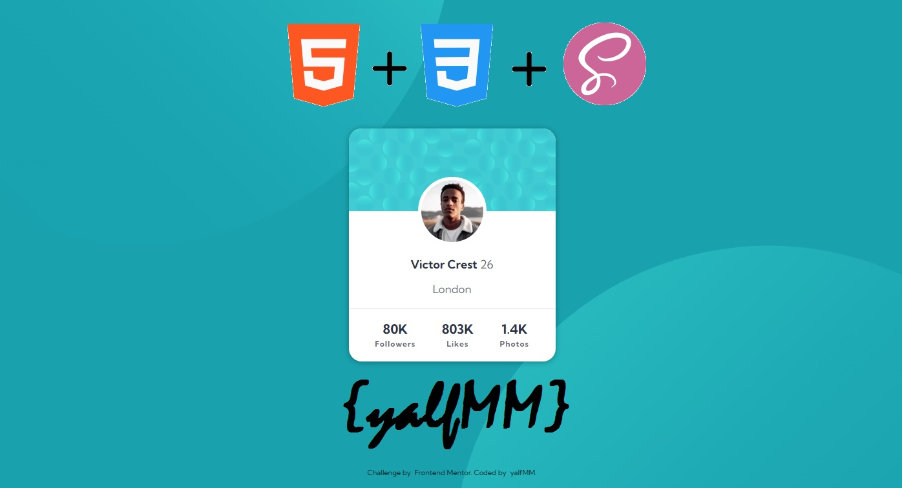

# Frontend Mentor - Profile card component

## Hello! 👋

Here is a solution to [Profile card component](https://www.frontendmentor.io/challenges/profile-card-component-cfArpWshJ). Frontend Mentor challenges help you improve your coding skills by building realistic projects. 

## Table of Content
- [Hello 👋](#hello-👋)
- [Table of Content](#table-of-content)
  - [The challenge](#the-challenge)
  - [Screenshot](#screenshot)
- [My Process](#my-process)
  - [What I learned](#what-i-learned)
  - [Built with](#built-with)
- [Author](#author)

### The challenge

Users should be able to:

- View the optimal layout depending on their device's screen size
- See hover and focus states for interactive elements

### Screenshot

## My Process

### What I learned

- Basic positioning in HTML, CSS with SCSS

### Built with

- Semantic HTML5 markup
- CSS custom properties
- CSS Flex
- SCSS
- Apply normalize.css from [Normalize.css](https://necolas.github.io/normalize.css/ "Normalize.css") to reset all styles
- Mobile-first workflow

## Author

- Website - [github/yalfmm](https://github.com/yalfmm)
- Frontend Mentor - [@yalfmm](https://www.frontendmentor.io/profile/yalfmm)